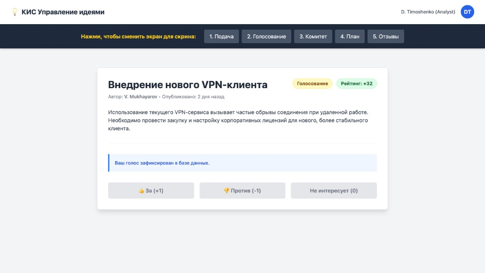

# Инструкция: Голосование

Раздел описывает механику коллективной оценки идей на этапе **«Голосование»**.

## 2.1. Уникальный голос

Система гарантирует прозрачность и честность рейтинга за счет следующих правил:

- **Один человек = один голос**: вы не можете проголосовать за одну и ту же идею дважды.
- **Варианты оценки** (кнопки внизу карточки идеи):
  - **«За»** — `+1` к рейтингу.
  - **«Против»** — `-1` к рейтингу.
  - **«Не интересует»** — `0` баллов; голос фиксируется как просмотренный.
- **Подтверждение**: после выбора отображается сообщение о том, что голос зафиксирован; кнопки голосования блокируются.

На карточке идеи отображаются текущий **статус** (например, «Голосование»), **рейтинг** и данные об **авторе**.

## 2.2. Значение статусов

Статус идеи определяет ее положение в жизненном цикле:

| Статус | Описание |
|--------|----------|
| **Голосование** | Сбор мнений сотрудников |
| **На согласовании** | Работа [Комитета](Инструкция-Комитет.md) |
| **Реализация** | Идея утверждена; автор готовит [план](Инструкция-Планирование.md) |
| **Реализована** | Внедрение завершено; открывается сбор [отзывов](Инструкция-Отзывы.md) |
| **Архив** | Идея отклонена или неактуальна |
