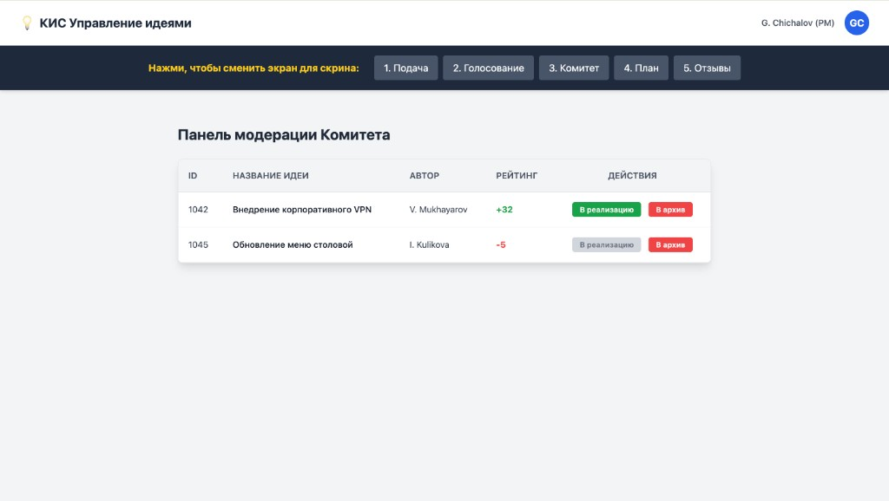

# Инструкция: Комитет

Раздел для членов **Комитета** (модераторов). На этапе **«Комитет»** рассматриваются идеи, прошедшие голосование.

## 3.1. Панель модерации

В таблице **«Панель модерации Комитета»** отображаются:

- **ID** и **название** идеи;
- **автор**;
- **рейтинг** (итог голосования сотрудников).

Положительный рейтинг выделяется зелёным, отрицательный — красным.

## 3.2. Решения Комитета

Для каждой идеи доступны действия:

- **«В реализацию»** — идея утверждена и переходит к [планированию](Инструкция-Планирование.md). Кнопка может быть недоступна, если рейтинг ниже порога, установленного правилами системы.
- **«В архив»** — идея отклонена (дублирование, низкая целесообразность и т.п.).

После утверждения автор идеи становится ответственным за реализацию.
