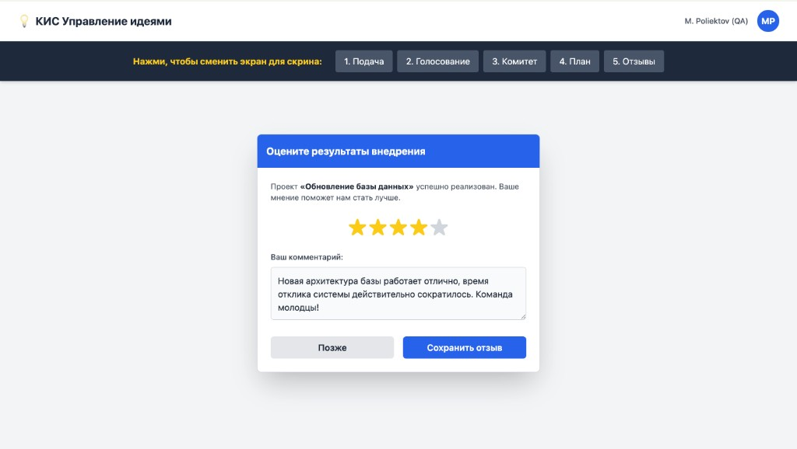

# Инструкция: Отзывы

На финальном этапе **«Отзывы»** сотрудники оценивают результаты внедрения завершённых проектов.

## 5.1. Оценка результатов

После перевода идеи в статус **«Реализована»** система может показать окно **«Оцените результаты внедрения»**:

- выберите оценку **звёздами** (от 1 до 5);
- при желании заполните поле **«Ваш комментарий»**;
- нажмите **«Сохранить отзыв»**.

Кнопка **«Позже»** откладывает оценку — вы сможете вернуться к ней на этапе **«Отзывы»** в верхней панели.

## 5.2. Зачем нужны отзывы

Обратная связь помогает оценить качество внедрения и улучшать процесс управления идеями в организации.
