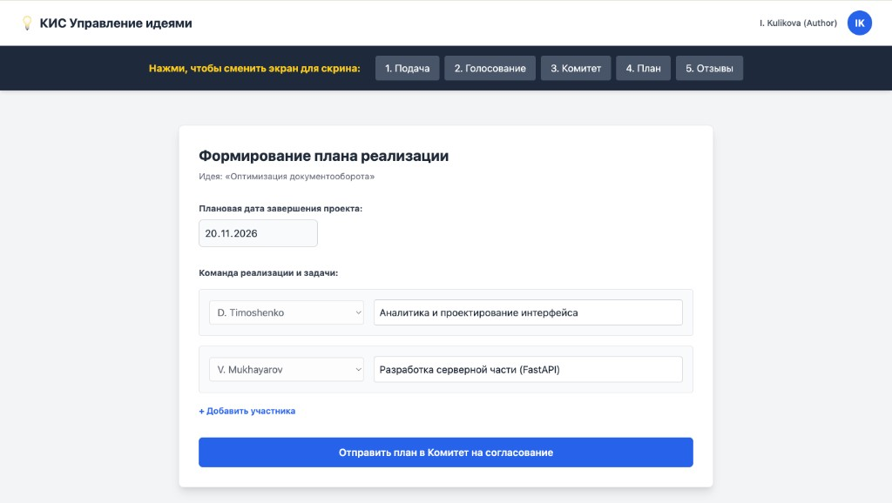

# Инструкция: Планирование

На этапе **«План»** автор утверждённой идеи формирует дорожную карту внедрения. Автор идеи автоматически становится **ответственным** за реализацию.

## 4.1. Создание плана реализации

После перевода идеи Комитетом в статус **«Реализация»** откройте экран **«Формирование плана реализации»** и укажите:

- **Плановая дата завершения проекта**;
- **Команда реализации и задачи**: для каждого участника выберите сотрудника из справочника и опишите его задачу (например, аналитика, разработка);
- при необходимости нажмите **«+ Добавить участника»**, чтобы расширить состав команды.

Нажмите **«Отправить план в Комитет на согласование»**.

## 4.2. Согласование плана

Комитет проверяет план:

- при одобрении проект переходит к выполнению работ;
- при замечаниях план возвращается автору на доработку.

## 4.3. Завершение работ

В ходе реализации ответственный обновляет статусы задач. По завершении всех работ переведите идею в статус **«Реализована»** — после этого участникам будет предложено оставить [отзыв](Инструкция-Отзывы.md).
