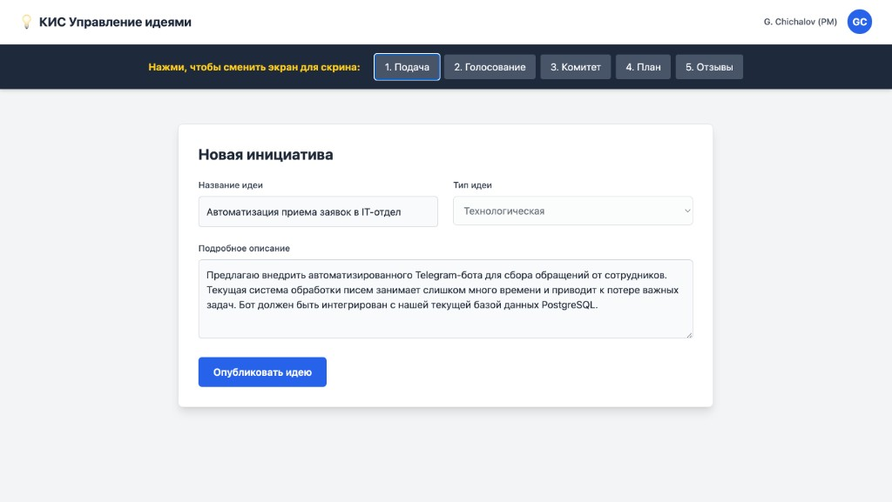

# Инструкция: Подача идеи

Данный раздел описывает процесс инициации инновационного предложения в системе **КИС «Управление идеями»**.

## 1.1. Заполнение формы

Для создания новой заявки откройте этап **«Подача»** (первый шаг в верхней панели) или перейдите в раздел **«Добавить идею»**. Заполните форму **«Новая инициатива»**:

- **Название идеи**: краткое название предложения (до 100 символов).
- **Тип идеи**: категория из выпадающего списка (например, «Технологическая», «Организационная»).
- **Подробное описание**: суть проблемы и предлагаемого решения.

Нажмите **«Опубликовать идею»**. Идея сохраняется в системе и сразу отображается в общей ленте для сотрудников организации.

## 1.2. Что происходит дальше

После публикации идея автоматически переходит на этап голосования. Подробнее см. [Инструкция: Голосование](Инструкция-Голосование.md).
